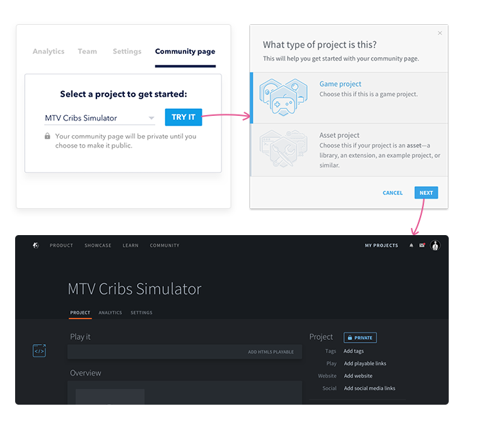
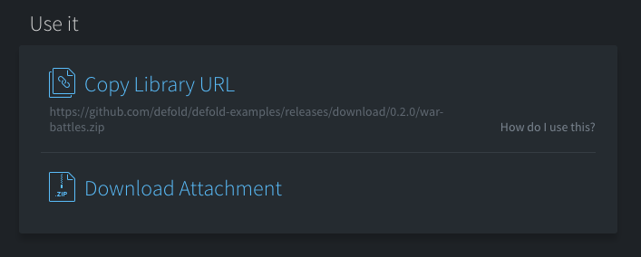
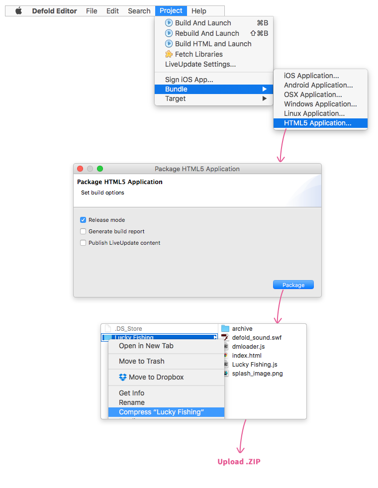

# Defoldコミュニティページ

私たちはすべてのDefoldユーザーのためのコミュニティプラットフォーム（フォーラムでは「Project：Sticky Iron」として知られています）を構築中です。今後も機能の構築とプラットフォームの拡張を続ける予定ですが、最初のリリースにはコミュニティページが含まれています。コミュニティページでは、ゲームやアセットを簡単に共有したり、コミュニティが作ったゲームやアセットを見つけたりできます。

__________________

## コミュニティページ

「コミュニティページ」は、DefoldサイトのGamesセクションやAsset Potalセクションに掲載されている全てのページを表す言葉です。コミュニティページの作成は非常に簡単です。ダッシュボードにサインインしてプロジェクトを選択し、[Settings]の横にある[Community page]タブをクリックし、[Try it]をクリックしてゲームコミュニティページまたはアセットコミュニティページを作成します。GamesセクションまたはAsset portalセクションからコミュニティページを作成することもできます。

*コミュニティページの作成に必要な2つの手順*

あなたのコミュニティページは、デフォルトでは非公開になっています。全世界に共有する準備が整ったら、ページを公開しましょう。（表示設定を参照）コミュニティページには、ゲームコミュニティページとアセットコミュニティページの2種類があります。

## ゲームコミュニティページ

ゲームコミュニティページは、完成したゲーム専用のコミュニティページです。コミュニティページは自由にカスタマイズすることができ、開発ログ、タグ、再生可能なHTML5ファイル、説明テキスト、画像などを自由に追加できます。すべての公開されたゲームコミュニティページは、Gamesセクションに掲載されます。

## アセットコミュニティページ

アセットトコミュニティページは、アセット（ライブラリ、拡張機能、サンプルプロジェクト、スタンドアロンツール、チュートリアルなど）専用のコミュニティページです。ゲームコミュニティページと同様の構成内容を持ちますが、ゲームページとアセットページとの違いは、コミュニティとのアセットの共有の仕方に応じて、ライブラリとしての使用を有効にしたり、添付ファイルを追加したりできることです。すべての公開されたアセットコミュニティページは、Asset Potalセクションに掲載されます。

*アセットページでは、アセットをライブラリで使用するか、添付ファイルをアップロードすることができます。*

## カスタマイズ

コミュニティページを思い通りの内容にするために、様々な方法でカスタマイズできます。このセクションではできることをすべて説明します。カスタマイズはすべて、コミュニティページのタイトルのすぐ下にあるコミュニティページにある「Settings」タブから実行できます。.

再生可能なHTML5ファイル
: HTML5の再生機能を追加すると、簡単にゲームをプレイしたり、自分のアセットを試したりすることができます。プレイ可能なコンテンツを追加するには、次の手順に従います。

1) Defoldで。<kbd>Project ▸ Bundle ▸ HTML5 application</kbd>を選択。（HTML5のパフォーマンスを最適化するために「リリースモード」を必ずチェックしてください。）

2) バンドルプロセスで作成されたフォルダをzipファイルに圧縮します。

3) [Upload HTML5 Playable]をクリックし、バンドルプロセスで作成されたフォルダを含む.zipファイルをアップロードします。

HTML5 playable cover image
: 再生可能なHTML5カバー画像は、コミュニティページの「Play it」セクションに表示されるプレースホルダ画像です。タイトル画面やゲーム画面のスクリーンショットを使用することをお勧めします。

Dev log
: コミュニティページ内に簡単に開発ログを作成して、ゲームやアセットの開発状況を人々に知らせることができます。あなたのコミュニティページの一番下にある "New dev log"をクリックするだけでいいです。

Game/Asset title
: コミュニティページや一覧ページでアセットやゲームの名称として表示されます。ヒーローイメージにプロジェクトのタイトルがすでに含まれている場合は、デフォルトのタイトルを非表示にすることができます。

Tags
: ゲームやアセットを簡単に見つけられるよう、タグを追加できます。ゲームとアセットのタグは独立しています。タグは、コミュニティページを公開する前に追加する必要があります。

Description
: 説明には、プロジェクトの説明を記述します。アセットを公開する場合は、ここにアセットの使用方法を書くことをお勧めします。

  ほとんどのMarkdown記法を使用できます。つまり、ヘッダー、画像、仕切り、コードスニペットなどを追加できます。Markdownの仕組みについては、このガイド（https://guides.github.com/features/mastering-markdown/）を読むことをお勧めします。

Screenshots
: ゲームやアセットの内容を伝えるために、最大12個のスクリーンショットを追加できます。（間もなく動画もサポートされる予定です）

Thumbnail image
: サムネイル画像は、ゲーム/アセット一覧ページに表示される画像です。

Hero image
: ヒーローイメージ（またはカバーイメージ）は、コミュニティページの顔となる大きな画像で、ヘッダー領域に表示されます。

Link to external playable
: App Storeや外部サイトにプレイ可能なバージョンのゲームがある場合は、ここにリンクを追加できます。

Studio
: これはコミュニティページのクレジットを表示するために使用され、ポートフォリオやスタジオのウェブサイトなどにリンクすることができます。

Website
: ゲームやアセットに外部のウェブサイト、Githubリポジトリなどがある場合は、ここにリンクを記載できます。

Social media links
: あなたのゲームにソーシャルメディアのページがある場合、ここにリンクを記載できます。

## 表示設定

Private
: コミュニティページはデフォルトでは非公開(private)です。つまり、コミュニティページにアクセスできるのはあなたとあなたのチーム（あなたがプロジェクトを共有した人）のみです。チームのすべてのメンバーがコミュニティページを編集できます。

Public
: ゲームやアセットを世界中に公開する準備が整ったら、すぐに「private」ボタンをクリックして、表示設定として「public」を選択しましょう。コミュニティページを公開する前には、以下のことを行う必要があります。

ゲームページ
: ゲームを公開するには、タグを追加する必要があります。

アセットページ
: セットを公開するには、以下のことを行う必要があります。

  a) タグを追加

  b) ライセンスを選択

## アセット

アセットは、a）ライブラリの使用を有効にしているか、b）添付ファイルを追加したコミュニティページです。アセットページは、公開するとAsset Portalに表示されます。

## アセットのライブラリ使用を有効にする

あなたのアセットがライブラリとしての使用に適している場合（つまり、ライブラリまたは拡張機能を作成した場合）、「Add library URL」を選択してライブラリをあなたのコミュニティページに追加してください。これにより、アセットのホスティングを選択できます。

Easy Hosting
: プロジェクトをDefoldサーバーでホストしている場合（dashboard.defold.comからプロジェクトを作成した場合）、このオプションを選択すると、コミュニティが使用できるライブラリURLが生成されます。ただし、"game.project"ファイルに"Include dirs"のフォルダを追加しておく必要があります。

<!-- 備考: Defoldのサーバー上にホスティングされたアセットに依存している人々に対して、安定したホスティングソリューションを提供することは我々にとって非常に重要と考えています。ライブラリの依存関係を破壊しないために、*Easy Hostingを使用してホストされているリリース*を削除することはできないようになっています。しかし、アセットの公開を継続したくない場合に表示設定を「非公開」に切り替えること、最新版にバグがある場合に新しいリリースを作成することは可能です。それらを行っても、*あなたのライブラリや拡張機能を使用しているプロジェクトは、ライブラリの使用を継続するとができます。* 依存関係が破壊されることが心配な場合は、使用しているライブラリや拡張機能をローカルにダウンロードして保存しておくことをお勧めします。

GitHub hosting
: アセットが公開GitHubリポジトリでホストされている場合はこのオプションを選択し、拡張機能またはライブラリのzipファイルへのリンクを記載します。zipファイルのルートフォルダに "game.project"ファイルがあり、 "game.project"ファイルに "Include dirs"のフォルダが追加されている必要があります。

## 添付ファイル

添付ファイルをアセットコミュニティページに追加することもできます。これは、アセットがスタンドアロンツール、ダウンロード可能なサンプルプロジェクト、アセットパックなどの場合に適しています。W

## ライセンス

アセットページを公開するには、アセットをどのように使用することを許可するかを人々に知らせるためのライセンスを選択する必要があります。CC0 1.0 Universalをお勧めします。これは、人々があなたのアセットを自由に使用できるようにするためです。しかし、あなたはもちろん、あなたが望むライセンスを自由に使うことができます。その場合は、「Custom」を選択し、必要な規約へのリンクを入力します。

**tl;dr ライセンスの説明**

CC0 1.0 Universal [https://creativecommons.org/publicdomain/zero/1.0/](https://creativecommons.org/publicdomain/zero/1.0/)
: これらのアセットは、個人・商業問わずプロジェクトで自由に使用できます。これらを使用する前に許可を求める必要はありません。クレジットを記載する必要はありません。

MIT license [https://en.wikipedia.org/wiki/MIT_License](https://en.wikipedia.org/wiki/MIT_License)
: 短く、制限の緩いソフトウェアライセンス。オリジナルのコピーライトおよびライセンスの記載をソフトウェア/ソースのコピーに含める必要はありますが、それ以外の制限はありません。

Apache License 2.0 [https://www.apache.org/licenses/LICENSE-2.0.html](https://www.apache.org/licenses/LICENSE-2.0.html)
: 必要な帰属通知を含める限り、ソフトウェアで好きなことをすることができます。この許可ライセンスには、コードの貢献者の特許ライセンスが含まれています。

GNU General Public License v 3.0 [https://opensource.org/licenses/GPL-3.0](https://opensource.org/licenses/GPL-3.0)
: ソースファイルの変更内容と変更日付を追跡可能とする限り、ソフトウェアを複製、頒布、修正することができます。GPLライセンスのコード自体の変更、又はGPLライセンスのコードを（コンパイラを介して）含むソフトウェアに対して変更を行った場合、その成果物もGPLライセンスでビルド・インストールの手順と共に配布する必要があります。
