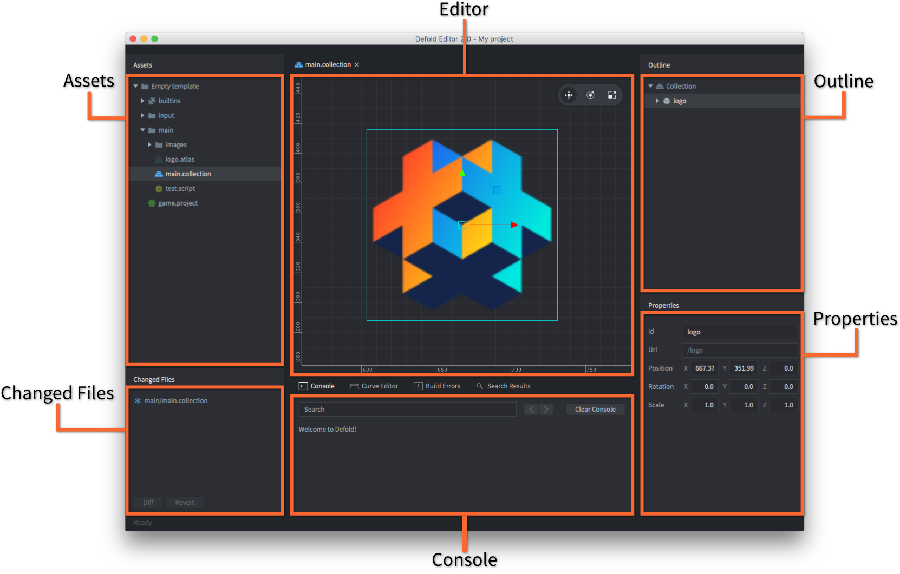

# エディタの概要

エディタを使用すると、ゲームプロジェクト内のすべてのファイルを効率的にブラウズして操作できます。 ファイルを編集すると適切なエディタが起動し、ファイルに関するすべての関連情報が別々のビューに表示されます。

## エディタの起動

Defoldエディタを実行すると、プロジェクトの選択と作成画面が表示されます。 左側には3つのメインビューがあります。 目的に応じたビューをクリックして選択してください。

HOME
: クリックすると最近開いたプロジェクトがリストに表示され、すばやくアクセスできます。 これはデフォルトの表示です。

NEW PROJECT
: 新しいDefoldプロジェクトを作成する場合はこのビューをクリックします。基本のテンプレートを元にプロジェクトを作成する場合は"From Template"タブを、チュートリアルを実施したい場合は"From Tutorial"タブを、サンプルプロジェクトを試したい場合は"From sample"タブを選択してください。

  {srcset="images/editor/new_project@2x.png 2x"}

  新しいプロジェクトを作成するとローカルドライブに保存され、編集内容はローカルに保存されます。 チームのメンバーとプロジェクトを共有するには、エディタの同期機能を使用します。 これは、あなたとあなたのチームが作業を同期させるためのDefoldクラウドGitストレージプロジェクトを作成します。

プロジェクトのインポート
: あなたのDefoldクラウドGitストレージアカウントから、既存のプロジェクトから作業コピーを作成します。 ローカルコピーはクラウドGitプロジェクトにリンクされているので、チームの同期が可能です。

  {srcset="images/editor/import_project@2x.png 2x"}

  Defoldクラウドストレージにアクセスするには、Defoldアカウントの認証情報が必要です。

## エディタビュー

Defoldエディタは、特定の情報を表示する一連のペインまたはビューに分かれています。

*Assets*ビュー
: プロジェクトに含まれるすべてのファイルを一覧表示します。 クリックやスクロールにより、リストをナビゲートします。 このビューでは、すべてのファイルに関連する操作を行うことができます。

::: sidenote
エディタ1では見た目は異なりますが、ほぼ同じように動作します。機能的な違いは僅かです。
:::

   - ファイルを<kbd>ダブルクリック</kbd>すると、ファイル形式に応じてエディタ上でファイルを開きます。
   - ディスク上のファイルを<kbd>ドラッグアンドドロップ</kbd>することで、プロジェクトにファイルを追加できます。また、プロジェクト上のファイルを<kbd>ドラッグアンドドロップ</kbd>してプロジェクト上の他の場所に移動できます。
   - <kbd>右クリック</kbd>でポップアップメニューを開きます。ポップアップメニューでは、新規ファイル・フォルダの作成、リネーム、削除、ファイルの依存関係の追跡等を行えます。

*Editor*ビュー

: 中央のビューには、現在開いているファイルがファイルタイプに応じたエディタにで表示されます。 ビジュアルエディタでは、カメラビューの変更が可能です。

- パン： <kbd>Alt +左​​マウスボタン</kbd> 。
- ズーム： <kbd>Alt +右ボタン （3ボタンマウス）</kbd>または<kbd>Ctrl +マウスボタン</kbd> （1ボタン）。 スクロールホイールがあるマウスでは、マウスホイールでもズームできます。
- 回転（3D）： Ctrl +左マウスボタン 。

シーンビューの右上隅のツールバーに、オブジェクト操作ツール（移動、回転、スケール）があります。

{srcset="images/editor/toolbar@2x.png 2x"}

複数のファイルを開いている場合、ファイル毎のタブがエディタビューの上部に表示されます。2つのファイルのエディタビューを2つのペインに並べて表示することができます。並べて表示するには、別のペインに移動するエディタのタブを右クリックし 、<kbd>Move to Other Tab Pane</kbd>を選択します。

{srcset="images/editor/2-panes@2x.png 2x"}

また、タブメニューを使用して、2つのペインの位置を入れ替えたり1つのペインに統合することもできます。

*Outline*ビュー
: このビューは現在編集中のファイルの内容をツリー構造で表示します。アウトラインにはエディタビューの編集内容が反映されており、アイテムに対して操作を実行できます。
   - <kbd>クリック</kbd>してアイテムを選択します。<kbd>Shift</kbd>キー又は <kbd>Option</kbd>キーを押しながら選択範囲を展開します。
   - <kbd>ドラッグアンドドロップ</kbd>してアイテムを移動します。 コレクション内の別のゲームオブジェクトにゲームオブジェクトをドロップして、それを子オブジェクトにします。
   - <kbd>右クリック</kbd>でポップアップメニューが開き、そこからアイテムを追加したり、選択したアイテムを削除したりすることができます。

*Properties*ビュー
: このビューには、現在選択されているアイテムに関連するプロパティ（位置、回転、アニメーションなど）が表示されます。

*Console*ビュー
: このビューには、ゲーム実行中のエラー出力やコンソール出力が表示されます。 コンソールの横には、パーティクルエディタでカーブを編集するときに使用される*Curve Editor*、 ビルドエラーを表示する*Build Errors*ビュー、 検索結果を表示する*Search Results*ビューが含まれます。 コンソールは、対話型デバッガによるデバッグにも使用されます。

*Changed Files*ビュー
: このビューには、プロジェクト中の変更・追加・削除されたファイルが一覧表示されます。 プロジェクトを定期的に同期させることで、プロジェクトのGitリポジトリの内容とローカルコピーを同期させることができます。これにより、チーム内でのコラボレーションを実現でき、また万一のことが起きた場合でも作業の復元が可能です。 このビューでは、いくつかのファイル操作を行えます。

   - ファイルを<kbd>ダブルクリック</kbd>すると、そのファイルのdiffビューが開きます。 エディタ2では、Assetsビューと同様に適切なエディタでファイルを開きます。
   - ファイルを<kbd>右クリック</kbd>するとポップアップメニューが開き、差分ビューを開く、ファイルに加えられたすべての変更を元に戻す、ファイルシステム上でファイルを表示する等の操作を行えます。（エディタ2）。

## シーンエディタ

*シーンエディタ*では、コンポーネントおよびコレクションを使用して、ゲームオブジェクトの作成および編集を行います。

オブジェクトの選択
: メインウィンドウ内のオブジェクトをクリックして選択します。 エディタビュー内のオブジェクトを囲む矩形を緑色にハイライト表示して選択中のアイテムを示します
。*Outline*ビューでも、選択したオブジェクトがハイライト表示されます。

  オブジェクトの選択は以下の方法で行えます。

  - <kbd>クリック・ドラッグ</kbd>して矩形範囲を選択すると、範囲内の全てのオブジェクトが選択されます。
  - *Outline*ビューでオブジェクトを<kbd>クリック</kbd>します

  Shift キーまたは⌘ （Mac）/ Ctrl （Win / Linux）を押しながらクリックすると、選択対象が拡張されます。

移動ツール
: {.left}
  オブジェクトを移動するには、 移動ツールを使用します。 移動ツールはシーンエディタの右上隅にあるツールバー内の移動ツールを選択するか、Wキーを押すことで使用できます。

  

  選択されたオブジェクトにはマニピュレータのセット（四角と矢印）が表示されます。 中央の緑色の四角いハンドルをクリック・ドラッグするとオブジェクトがビュー空間に沿って自由に移動し、矢印をクリック・ドラッグするとオブジェクトがX、Y、またはZ軸に沿って移動します。 XY平面内でオブジェクトを動かすための四角いハンドルと、XZ平面とYZ平面内のオブジェクトを動かすための（カメラを3Dで回転させると見える）ハンドルもあります。

回転ツール
: {.left}
  オブジェクトを回転するには、 ツールバー内の回転ツールを選択するか、 Eキーを押します。

  

  このツールは、4つの円形マニピュレータで構成されています。 オブジェクトをビュー空間に沿って回転させるオレンジのマニピュレータはと、X・Y・Z軸のそれぞれの周りにオブジェクトを回転させるマニピュレータです。 X・Y軸用のマニピュレータは、ビュー空間がは軸とY軸に対して垂直なため、オブジェクトを横切る2本の線として表示されます。

::: sidenote
現在、スプライトコンポーネントはエディタ上で個別に拡大縮小することはできません。スプライトを保持するゲームオブジェクトを拡大縮小する必要があります。 ただし、実行中はスプライトを自由に拡大縮小できます。詳細については、[2Dグラフィック](/manuals/2dgraphics/)を参照してください。
:::

拡大縮小ツール
: {.left}
  オブジェクトを拡大縮小するには、 ツールバー内の回拡大縮小ツールを選択するか、 Rキーを押します。

  

  このツールは、四角いハンドルのセットで構成されています。 中心のハンドルは、Z軸を含むすべての軸でオブジェクトを均一に拡大縮小します。 また、X軸・や軸・Z軸に沿った拡大縮小を行うハンドル、XY平面、XZ平面、YZ平面での拡大縮小を行うハンドルが用意されています。
