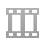
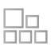
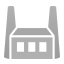
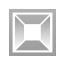
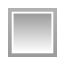
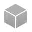
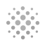
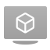
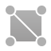

# Defold用語集

この用語集では、Defoldで遭遇するすべての事柄について簡単に説明します。ほとんどの場合、詳細なドキュメントへのリンクがあります。

## アニメーションセット(Animation set)

{.left} アニメーションセットリソースには、.daeファイルまたはアニメーションを読む場所からの他の.animationsetファイルのリストが含まれています。複数のモデル間で部分的なアニメーションセットを共有する場合、.animationsetファイルを別の.animationsetファイルに追加すると便利です。詳細については、[3Dグラフィックスマニュアル](/manuals/3dgraphics/)を参照してください。

## アトラス(Atlas)

{.left} Atlasは、パフォーマンスとメモリの理由から、大きなシートにコンパイルされた別々のイメージのセットです。複数の静止画やフリップブックアニメーションの一連の画像を含むことができます。AtlasはGUI、Sprite、Spineモデル、ParticleFXコンポーネントで使用され、グラフィックスリソースを共有します。詳細については[2Dグラフィックス](/manuals/2dgraphics)のドキュメントを参照してください。

## ビルトイン(Builtins)

{.left} builtinsプロジェクトフォルダは、有用なデフォルトリソースを含む読み取り専用フォルダです。ここでは、デフォルトのレンダラー、レンダリングスクリプト、マテリアルなどが見つかります。これらのリソースのいずれかにカスタムの変更が必要な場合は、プロジェクトにコピーして、適切に編集してください。

## カメラ(Camera)

{.left} Cameraコンポーネントは、ゲーム世界のどの部分を見えるようにし、どのように投影するべきかを決定するのに役立ちます。一般的な使用例は、プレーヤーのゲームオブジェクトにカメラを付与することです。または、いくつかのスムージングアルゴリズムを使用して、カメラ用の別のゲームオブジェクトを用意してプレーヤーの周りを追わせることができます。詳細については、[カメラのドキュメント](/manuals/camera)を参照してください。

## 衝突オブジェクト(Collision object)

{.left} 衝突オブジェクトは、物理的特性（空間形状、重量、摩擦、および反発力など）でゲームオブジェクトを拡張するコンポーネントです。これらのプロパティは、衝突オブジェクトが他の衝突オブジェクトとどのように衝突するかを制御します。衝突オブジェクトの最も一般的なタイプは、キネマティックオブジェクト、動的オブジェクト、トリガーです。キネマティックオブジェクトは、手動で応答する必要のある詳細な衝突情報を提供します。ダイナミックオブジェクトは物理エンジンによって自動的にシミュレートされ、ニュートンの物理法則に従います。トリガーは、他の図形がトリガーに入ったり出たりしたかどうかを検出するシンプルな図形です。この仕組みの詳細については、[Physicsのドキュメント](/manuals/physics)を参照してください。

## コンポーネント(Component)

コンポーネントは、グラフィックス、アニメーション、コードで記述された動作およびサウンドのように、ゲームオブジェクトに特定の表現および/または機能性を与えるために使用されます。コンポーネントは単独では動作せず、ゲームオブジェクに付与する必要があります。Defoldには多くの種類のコンポーネントが用意されています。コンポーネントの説明については、[ビルディングブロックマニュアル](/manuals/building-blocks) を参照してください。

## コレクション(Collection)

{.left} コレクションは、テンプレートを作成するためのDefoldのメカニズムです。他のエンジンでは、ゲームオブジェクトの階層を再利用できる「プレハブ」と呼ばれています。コレクションは、ゲームオブジェクトやその他のコレクションを保持するツリー構造です。コレクションは常にファイルに保存され、手動でエディタに配置することで静的にゲーム上に配置、ああるいは実行中に生成することで動的にゲーム上に生成されます。コレクションの説明については、[ビルディングブロックマニュアル](/manuals/building-blocks) を参照してください。

## コレクションファクトリー(Collection factory)

{.left} コレクションファクトリコンポーネントは、ゲームオブジェクトの階層を実行中のゲームに動的に生成するために使用されます。詳細については、[コレクションファクトリマニュアル](/manuals/collection-factory) を参照してください。

## コレクションプロキシ(Collection proxy)

{.left} コレクションプロキシは、アプリケーションやゲームの実行中にコレクションをロードして有効化するために使用されます。コレクションプロキシの最も一般的な使用例は、ゲームレベルをロードすることです。詳細については、[Collectionプロキシのドキュメント](/manuals/collection-proxy)を参照してください。

## キューブマップ(Cubemap)

{.left} キューブマップは、キューブの側面にマップされる6種類のテクスチャで構成された特殊なタイプのテクスチャです。スカイボックスやさまざまな種類の反射および照明マップをレンダリングするのに便利です。

## デバッグ(Debugging)

あなたのゲームは時に予期しない動作をし、何が間違っているかを把握する必要に迫られます。デバッグの方法を学ぶには熟練が必要ですが、幸いなことにDefoldは組み込みのデバッガを持ちます。詳細については、[デバッグマニュアル](/manuals/debugging)を参照してください。

## ファクトリー(Factory)

{.left} 必要なすべてのゲームオブジェクトをコレクション内に手動で配置することができない場合もあり、その場合はゲーム中に動的にゲームオブジェクトを生成する必要があります。たとえば、プレーヤーが銃弾を発射する場合、プレイヤーがトリガーを押すたびに各ショットが動的に生成されて発射されます。ゲームオブジェクトを（事前に割り当てられたオブジェクトプールから）動的に作成するには、ファクトリコンポーネントを使用します。詳細については、[ファクトリマニュアル](/manuals/factory)を参照してください。

## フォント(Font)

{.left} フォントリソースは、TrueTypeまたはOpenTypeフォントファイルから作成されます。フォントには、レンダリングサイズと、フォントの装飾の種類（輪郭と影）を指定します。フォントは、GUIコンポーネントとLabelコンポーネントで使用されます。詳細については、[フォントマニュアル](/manuals/font/)を参照してください。

## フラグメントシェーダ(Fragment shader)

{.left} これは、ポリゴン内の各ピクセル（フラグメント）がスクリーンに描画されるときに、グラフィックスプロセッサ上で実行されるプログラムです。フラグメントシェーダの目的は、各フラグメントの色を決定することです。これは、計算、1つまたは複数のテクスチャの参照（1つまたは複数）、またはテクスチャの参照と計算の組み合わせによって行われます。詳細については、[Shaderのマニュアル](/manuals/shader)を参照してください。

## ゲームパッド(Gamepads)

{.left} ゲームパッドリソースファイルは、特定のゲームパッドデバイスの入力があるプラットフォーム上のゲームパッド入力トリガにどのようにマッピングされるかを定義します。詳細については[入力マニュアル](/manuals/input)を参照してください。

## ゲームオブジェクト(Game object)

{.left} ゲームオブジェクトは、ゲームの実行中に別々のライフサイクルを持つ単純なオブジェクトです。ゲームオブジェクトはコンテナであり、通常、サウンドやスプライトのような視覚的または聴覚的なコンポーネントが装備されています。スクリプトコンポーネントを介して動作を装備することもできます。ゲームオブジェクトを作成してエディタでコレクションに配置するか、実行時にファクトリを使用して動的に生成します。ゲームオブジェクトの説明については、[ビルディングブロックマニュアル](/manuals/building-blocks)を参照してください。

## GUI

{.left} GUIコンポーネントには、ユーザーインターフェイスを構成する要素（テキスト、色付き/テクスチャ付きのブロック）が含まれています。要素は、スクリプトやアニメーションの階層構造で編成できます。GUIコンポーネントは、通常、ヘッドアップディスプレイ、メニューシステム、およびオンスクリーン通知を作成するために使用されます。GUIコンポーネントは、GUIの動作を定義し、ユーザーのGUI操作をコントロールするGUIスクリプト
によって制御されます。詳しくは、[GUIのドキュメント](/manuals/gui)を参照してください。

## GUIスクリプト(GUI script)

{.left} GUIスクリプトは、GUIコンポーネントの動作を制御するために使用されます。これらは、GUIアニメーション、およびユーザーのGUI操作を制御します。LuaスクリプトがDefoldでどのように使われるかについては、[DefoldでのLua言語](/manuals/lua)を参照してください。

## ホットリロード(Hot reload)

デスクトップ・デバイス上の実行中のゲームに、Defoldエディタでのコンテンツの更新を動的に反映できます。この機能は非常に強力で、開発ワークフローを大幅に向上させることができます。詳細については、[ホットリロードマニュアル](/manuals/hot-reload)を参照してください。

## 入力バインディング(Input binding)

{.left} 入力バインディングファイルは、ゲームのハードウェア入力（マウス、キーボード、タッチスクリーン、ゲームパッド）の解釈方法を定義します。このファイルはハードウェア入力を"jump"や "move_forward"のような入力アクションにバインドします。入力を受け取るスクリプトコンポーネントでは、特定の入力が与えられたときにゲームやアプリが取るべきアクションをスクリプト化することができます。詳細は[入力ドキュメント](/manuals/input)を参照してください。

## ラベル(Label)

{.left} ラベルコンポーネントを使用すると、任意のゲームオブジェクトにテキストを添付することができます。これは、スクリーン上のゲーム空間で、特定のフォントでテキストをレンダリングします。詳細については、[ラベルのマニュアル](/manuals/label)を参照してください。

## ライブラリ(Library)

{.left} Defoldでは、強力なライブラリ機構によってプロジェクト間でデータを共有できます。これをにより、あなた自身またはチーム全体のすべてのプロジェクトからアクセス可能な共有ライブラリを設定できます。ライブラリの詳細については、[ライブラリのドキュメント](/manuals/libraries)を参照してください。
Defold allows you to share data between projects through a powerful library mechanism. You can use it to set up shared libraries that are accessible from all your projects, either for yourself or across the whole team. Read more about the library mechanism in the [Libraries documentation](/manuals/libraries).

## Lua言語

Defoldでは、ゲームロジックの作成にLuaプログラミング言語を使用します。Luaは強力で効率的な非常に小さなスクリプト言語です。手続き型プログラミング、オブジェクト指向プログラミング、関数型プログラミング、データ駆動型プログラミング、およびデータ記述をサポートしています。言語についての詳細は、公式のLuaホームページ（https://www.lua.org/）および[DefoldでのLuaマニュアル](/manuals/lua)を参照してください。

## Luaモジュール

{.left} Luaモジュールを使用すると、プロジェクトを構造化し、再利用可能なライブラリコードを作成することができます。詳細については、[Luaモジュールのマニュアル](/manuals/modules/)を参照してください。

## マテリアル(Material)

{.left} マテリアルは、異なるオブジェクトがシェーダやそのプロパティによってどのようにレンダリングされるかを定義します。詳細については、[マテリアルのマニュアル](/manuals/material)を参照してください。

## メッセージ(Message)

コンポーネントは、メッセージの受け渡しを通じて、お互いや他のシステムと通信します。また、コンポーネントは、一連の事前定義された変更やトリガーのメッセージに応答します。例えば。グラフィックを隠す、サウンドを再生する、または物理オブジェクトを微調整する等のメッセージを送信することができます。また、エンジンは物理オブジェクトの衝突等のイベントをコンポーネントにメッセージで通知します。メッセージ送受信機構は、送信するメッセージごとに受信者を指定する必要があります。したがって、ゲーム内のすべてのものには、一意にアドレスが割り振られます。Defoldは、メッセージの送受信によって、Luaをオブジェクト間の通信可能に拡張します。また、Defoldは有用な関数のライブラリを提供します。

たとえば、ゲームオブジェクトからの爆発音を再生するために必要なLuaコードは次のようになります。

```lua
msg.post("#explosion", "play_sound")
```

ここで"#explosion"は、現在のオブジェクトのサウンドコンポーネントのアドレスです。"play_sound"は、サウンドコンポーネントが応答するメッセージです。メッセージの送受信の仕組みについて詳しくは、[メッセージ送受信のドキュメント](/manuals/message-passing)を参照してください。

## モデル(Model)

{.left} 3Dモデルコンポーネントを使用すると、Colladaメッシュ、スケルトン、およびアニメーションアセットをゲームにインポートできます。詳細については、[モデルのマニュアル](/manuals/model/)を参照してください。

## パーティクル(ParticleFX)

{.left} パーティクルは、特にゲームで素晴らしいビジュアルエフェクトを作成するのに非常に便利です。パーティクルを使って霧、煙、火、雨、落ち葉を作ることができます。Defoldには強力なパーティクルエフェクトエディタが含まれているため、ゲームでリアルタイムに実行しながらエフェクトを作成し調整することができます。[ParticleFXのドキュメント](/manuals/particlefx)はエフェクトがどのように動作するかについての詳細を提供します。

## プロファイリング(Profiling)

優れたパフォーマンスはゲームの鍵であり、ゲームのパフォーマンスを測定し、修正が必要なボトルネックやメモリの問題を特定するために、パフォーマンスとメモリのプロファイリングを行うことが不可欠です。Defoldで使用できるプロファイリングツールの詳細については、[プロファイリングのマニュアル](/manuals/profiling)を参照してください。

## レンダリング(Render)

{.left} レンダリングファイルには、ゲームを画面にレンダリングするときに使用される設定が含まれています。レンダリングファイルは、レンダリングに使用するレンダリングスクリプトと、どのマテリアルを使用するかを定義します。詳細については[レンダリングマニュアル](/manuals/render/)を参照してください。

## レンダリングスクリプト(Render script)

{.left} レンダリングスクリプトは、ゲームやアプリをどのように画面にレンダリングするかを制御するLuaスクリプトです。ほとんどの一般的なケースをカバーするデフォルトのレンダリングスクリプトがありますが、独自のライティングモデルやその他のエフェクトが必要な場合は、独自のスクリプトを記述することができます。レンダリングパイプラインの詳細については[レンダリングマニュアル](/manuals/render/)を、Luaスクリプトの使い方の詳細については[DefoldでのLuaマニュアル](/manuals/lua)を参照してください。

## スクリプト(Script)

{.left} スクリプトは、ゲームオブジェクトの動作を定義するプログラムを含むコンポーネントです。スクリプトを使用すると、ゲームのルール、さまざまなインタラクション（プレーヤーや他のオブジェクトなど）にオブジェクトがどのように応答するかを指定できます。すべてのスクリプトは、Luaプログラミング言語で書かれています。Defoldで作業するには、あなた自身かチームの誰かがLuaでプログラミングする方法を学ぶ必要があります。Luaの概要とLuaスクリプトがDefoldでどのように使われているかの詳細については、[DefoldでのLuaマニュアル](/manuals/lua)を参照してください。

## 音(Sound)

{.left} サウンドコンポーネントは特定のサウンドを再生します。現在、Defoldは、WAVおよびOgg Vorbis形式のサウンドファイルをサポートしています。詳細については、[サウンドマニュアル](/manuals/sound)を参照してください。

## Spineモデル(Spine model)

{.left} Spineモデルコンポーネントは、SpineのスケルトンアニメーションをDefoldで使用するために使用されます。Spineモデルの使用方法の詳細については、[Spineモデルマニュアル](/manuals/spinemodel)を参照してください。

## Spineシーン(Spine scene)

{.left} Spineシーンリソースは、Spine JSONデータファイルと、Defoldイメージアトラスファイル（グラフィックを含むボーンスロットを埋めるため）を結び付けます。[Spineアニメーションマニュアル](/manuals/spine)には、より多くの情報が含まれています。

## スプライト(Sprite)

{.left} スプライトは、グラフィックスでゲームオブジェクトを拡張するコンポーネントです。タイルソースまたはアトラスのいずれかから画像を表示します。スプライトには、フリップブック又はボーンアニメーションのサポートが組み込まれています。スプライトは通常、キャラクタやアイテムに使用されます。詳細については[2Dグラフィックス](/manuals/2dgraphics)のドキュメントを参照してください。

## テクスチャプロファイル(Texture profiles)

{.left} テクスチャプロファイルリソースファイルはバンドルプロセスでイメージデータ（Atlas、タイルソース、Cubemaps、モデルに使用されるスタンドアローンテクスチャ、GUIなど）を自動的に処理して圧縮するために使用されます。詳細は、[テクスチャプロファイルのマニュアル]](/manuals/texture-profiles)を参照してください。

## タイルマップ(Tile map)

{.left} タイルマップコンポーネントは、タイルソースの画像を表示する1つ以上のオーバーレイされたグリッドです。これらは、一般的に、ゲーム環境を構築するために使用されています（地面、壁、建物、障害物）。タイルマップは、指定されたブレンドモードを使用して、複数のレイヤーを重ねて表示できます。これは、例えば、芝生の背景タイルの上に葉を置くのに便利です。また、表示された画像を動的にタイル内で変更することも可能です。たとえば、橋を破壊して通れないようにしたい場合は、壊れた橋の画像と対応する物理的形状を含むタイルに置き換えればよいのです。詳細については、[2Dグラフィックスのドキュメント](/manuals/2dgraphics)を参照してください。


## タイルソース(Tile source)

{.left} タイルソースは、複数の小さい同じサイズの画像から構成されるテクスチャです。タイルソース内の一連の画像からフリップブックアニメーションを定義することができます。タイルソースは、画像データから衝突形状を自動的に計算することもできます。これは、オブジェクトが衝突・相互作用できるタイルレベルを作成するのに非常に便利です。タイルソースは、タイルマップコンポーネント（およびSpriteおよびParticleFX）によってグラフィックスリソースを共有するために使用されます。タイルソースよりもアトラスの方が適している場合も多いことに注意してください。詳細については[2Dグラフィックスのドキュメント](/manuals/2dgraphics)を参照してください。

## 頂点シェーダ(Vertex shader)

{.left} 頂点シェーダは、コンポーネントの基本のポリゴン形状の画面上の幾何学形状を計算します。任意のタイプのビジュアルコンポーネント（スプライト、Spineモデル、またはモデル）であれば、その形状はポリゴンの頂点座標のセットによって表されます。頂点シェーダプログラムは、（ワールド空間内の）各頂点を処理し、プリミティブの各頂点が有するべき座標を計算します。詳細については、[Shaderのマニュアル](/manuals/shader)を参照してください。
