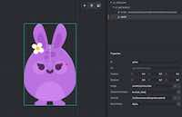
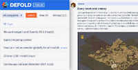

# Defoldへようこそ

Defoldは、ゲームのデザイン・ビルド・公開（販売）を助けるプロフェッショナルなゲーム製作プラットフォームとして開発されました。Defoldは全てを解決する魔法の道具ではありません。すぐに使える複雑な部品は用意されていません。その代わりに、シンプルでパワフルなコラボレーションツールとして開発チームを手助けしてくれるツールであると我々は信じています。これは、一人一人の作業が少しだけ増える代わりに、ゴールへの道筋を明確にしてくれることを意味します。

あなたが新米であれ熟練の開発者であれ、Defoldのコンセプトを完全に理解するには少し時間がかかると思います。ぜひ、試行錯誤して、チュートリアルを実施して、マニュアル・APIドキュメントを読んで下さい。他のユーザーから学び、Defoldの開発状況をフォローするためにフォーラムに参加してください。

## どこから始める？

マニュアル・APIリファレンス・サンプルやチュートリアル等のたくさんのドキュメントが利用できます。どこから始めていいか分からないなら、以下を参考にしてください。

エディター
: {.left} [エディター概要](/manuals/editor/) では、エディターの概要、ビジュアルツールの使い方・コードの書き方等を学びます。3DモデリングツールやプログラミングIDEに精通しているならば驚きはほとんどありませんが、お気に入りのソフトウェアとは異なる部分もあるはずです。

簡単な例
: {.left} [簡単な例](/examples/)は、Defoldの機能を組み合わせて制作に必要な様々な実装を行う方法を紹介しています。Defoldで行える様々な動作の実装について、最小限の例を見つけることができます。

Lua言語
: {.left} Defoldでは、すべてのロジック制御に[Luaを使用](/manuals/lua/)します。エンジンは高速のC ++機械ですが、Luaプログラムによって高レベルで制御されています。 Python、Javascript、または他の高水準言語でプログラミングしたことがあるなら、Luaはかなり簡単に理解でき、チュートリアルの実施にも困らないでしょう。 そうでない場合は、Luaのマニュアルをよく読みながら実施しましょう。

ゲームチュートリアル
: {.left} 実際にゲーム制作を行うことは、Defoldを学ぶための最良の方法です。様々な技術・複雑さのチュートリアルを[エディタ](/manuals/editor/)から直接入手することができます。実際にチュートリアルに従ってゲーム制作を実施し、ゲームを制作する方法とDefoldの仕組みを学んでください。

Defoldの構成ブロック
: {.left} [Defoldのゲームは単純なブロックの組み合わせで構築されています](/manuals/building-blocks/)。Defoldのブロックには特別な設計思想があり、使いこなすのには少し時間がかかります。ブロックがどのように働いているのかを完全に理解する必要があると感じたならば、構成ブロックのマニュアルを読むことから始めるとよいでしょう。

フォーラム
: {.left} [他者から学ぶこと](//forum.defold.com/)は、多くの場合とても良いことです。Defoldのコミュニティはとてもフレンドリーで、一般的なゲーム制作・特にDefoldでの制作について多くのノウハウを持っています。一人では解決できなくなった場合は、気軽にフォーラムに助けを求めてください。

どのような道筋でDefoldを学習する場合でも、いつでもここに立ち返って様々な機能やコンセプトの詳細説明を確認できることを覚えておいてください。そして、理解できないこと・間違っていると思うことがあれば、躊躇わずに指摘してください。これらのページはあなたのためのものであり、我々は可能な限り良いものにしたいと考えています。

Defoldでのゲーム制作を楽しんで頂けることを願っています！
