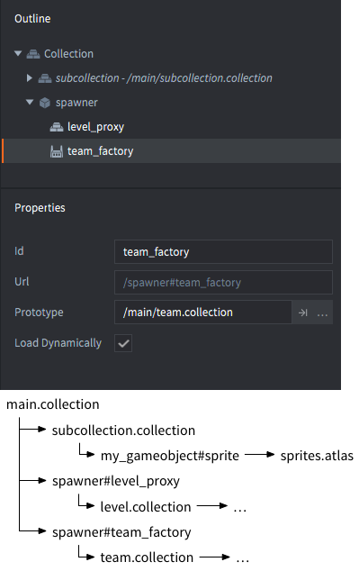
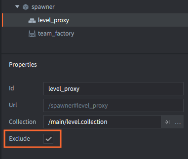

# リソース管理

小規模なゲームでは、メモリ使用量・アプリのサイズ・CPUパワー・バッテリー消費等を気にする必要はないでしょう。しかし、大規模なゲームを製作する場合、特にスマホアプリでは、メモリ使用量は非常に重大な制限になります。熟練の開発チームは、プラットフォームの制約に合わせて慎重にリソースの割り当てを行います。Defoldでは、メモリ使用量・アプリのサイズを管理するための幅広い機能を備えています。このマニュアルでは、それらの機能の概要を説明します。

## 静的リソースツリー

Defoldでゲームをビルドするとき、静的なリソースツリーを定義します。ゲーム内の全ての部品は、起動時コレクション（main.collection）から始まるツリーのどこかに関連付けられます。The resource tree follows any reference and includes all resources associated with those references:

- Game object and component data (atlases, sounds etc).
- Factory component prototypes (game objects and collections).
- Collection proxy component references (collections).
- Custom resources declared in "game.project".

When the game is *bundled*, only what is in the resource tree will be included. Anything that is not referenced in the tree is left out. There is no need to manually select what to include or exclude from the bundle.

When the game is *run*, the engine starts at the bootstrap root of the tree and pulls resources into memory:

- Any referenced collection and its content.
- Game objects and component data.
- Factory component prototypes (game objects and collections).

However, the engine will not automatically load the following types of referenced resources at runtime:

- Game world collections referenced through collection proxies. Game worlds are relatively large so you will need to manually trigger loading and unloading of these in code. See [the Collection proxy manual](/manuals/collection-proxy) for details.
- Files added via the *Custom Resources* setting in "game.project". These files are manually loaded with the [sys.load_resource()](/ref/sys/#sys.load_resource) function.

The default way Defold bundles and loads resources can be altered to give fine grained control over how and when resources enter memory.

## Dynamically loading factory resources

Resources referenced by factory components are normally loaded into memory when the component is loaded. The resources are then ready for being spawned into the game as soon as the factory exists in the runtime. To change the default behavior and postpone the loading of factory resources you can simply mark a factory with the *Load Dynamically* checkbox.

With this box checked, the engine will still include the referenced resources in the game bundle, but it will not automatically load the factory resources. Instead, you have two options:

1. Call [`factory.create()`](/ref/factory/#factory.create) or [`collectionfactory.create()`](/ref/collectionfactory/#collectionfactory.create) when you want to spawn objects. This  will load the resources synchronously, then spawn new instances.
2. Call [`factory.load()`](/ref/factory/#factory.load) or [`collectionfactory.load()`](/ref/collectionfactory/#collectionfactory.load) to load the resources asynchronously. When the resources are ready for spawning, a callback is received.

Read the [Factory manual](/manuals/factory) and the [Collection factory manual](/manuals/collection-factory) for details on how this works.

## Unloading dynamically loaded resources

Defold keeps reference counters for all resources. If a resource's counter reaches zero it means that nothing refers to it anymore. The resource is then automatically unloaded from memory. For example, if you delete all objects spawned by a factory and you also delete the object holding the factory component, the resources previously referred to by the factory is unloaded from memory.

For factories that are marked *Load Dynamically* you can call the [`factory.unload()`](/ref/factory/#factory.unload) or [`collectionfactory.unload()`](/ref/collectionfactory/#collectionfactory.unload) function. This call removes the factory component's reference to the resource. If nothing else refers to the resource (all spawned objects are deleted, for instance), the resource will be unloaded from memory.

## Excluding resources from bundle

With collection proxies, it is possible to leave out all the resources the component refers to from the bundling process. This is useful if you need to keep the bundle size to a minimum. For instance, when running games on the web as HTML5 the browser will download the whole bundle before executing the game.

By marking a collection proxy as *Exclude* the referenced resource will be left out of the game bundle. Instead, you can store excluded collections on selected cloud storage. The [Live update manual](/manuals/live-update/) explains how this feature works.
