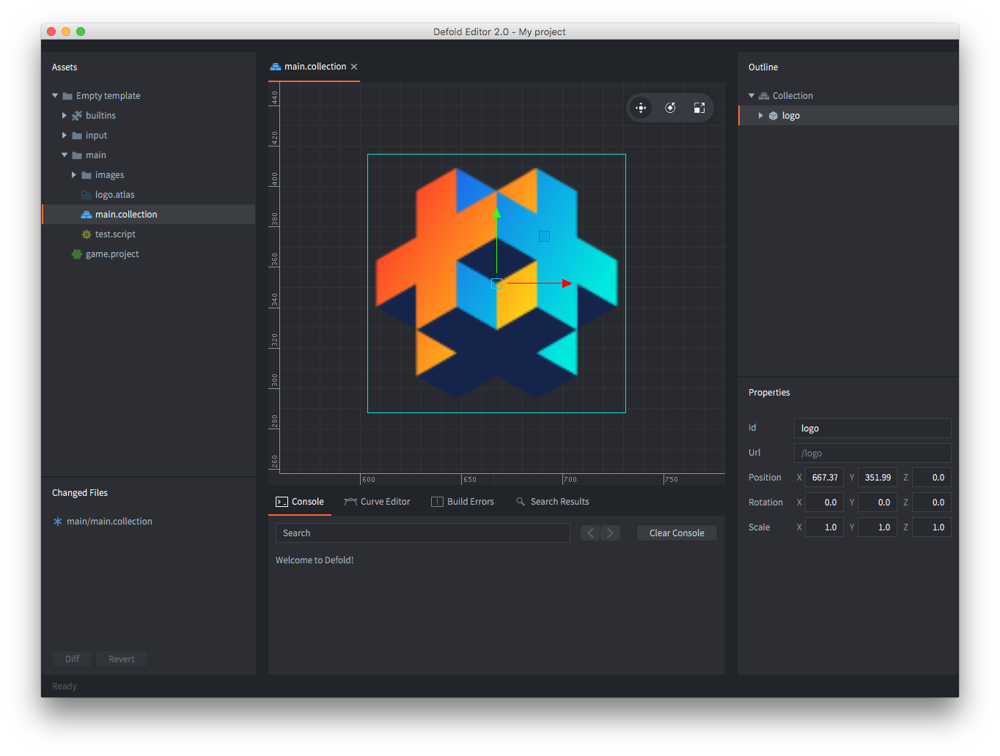

## エディタ1とエディタ2

私たちは現在、Defoldエディタ2に移行しています。エディタ2は現在、ベータ版です。新しく作成するドキュメントのほとんどはエディタ2のものです。最終的にはすべてのドキュメントをエディタ2のものに更新しますが、そのプロセスには時間がかかります。エディタのバージョンは、スクリーンショットのカラーテーマで判別できます。

エディタ2は新機能のダークテーマです。

エディタ1は標準のライトテーマです。

[新しいエディタ](https://www.defold.com/editor-two/)はご自由にお試しいただけます。
