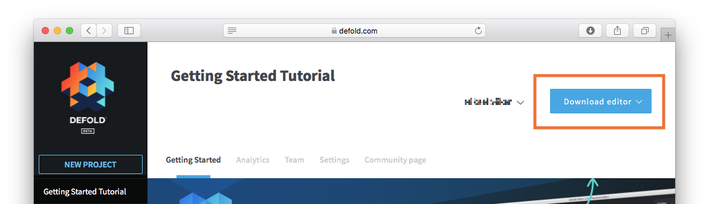

## ダウンロード

Defoldエディタのダウンロード・インストールをまだ行っていないならば、今がそのときです。

[Defoldダッシュボード](//dashboard.defold.com)にログインして、「Download editor」メニューボタンを見つけます。



"Download editor"をクリックして、ご使用のコンピュータに適したパッケージを選択します。

* MacOS
* Windows (32 bit)
* Windows (64 bit)
* Linux (64 bit)

レガシーバージョンのDefoldエディタ1のビルドも利用可能です。

## インストール

MacOSでのインストール
: ダウンロードしたファイルは、プログラムを含むDMGイメージです。

  1. ファイル "Defold-x86_64-darwin.dmg"をダブルクリックしてイメージを開きます。
  2. アプリケーション "Defold"を "Applications"フォルダのリンクにドラッグします。

  エディタを起動するには、 "Applications"フォルダを開き、"Defold"ファイルを<kbd>ダブルクリック</kbd>します。

  

Windowsでのインストール
: ダウンロードしたファイルは、解凍する必要のあるZIPアーカイブです。

  1. アーカイブファイル "Defold-x86_64-win32.zip"（または32ビットWindowsの場合は "Defold-x86-win32.zip"）を探し、フォルダを右クリックして"すべて展開"を選択し、手順に従ってアーカイブを"Defold"という名前のフォルダに解凍します。

  2. "Defold"フォルダを "C：\Program Files（x86）"に移動します。

  エディタを起動するには、 "Defold"フォルダを開き、 "Defold.exe"ファイルをダブルクリックします。

  

Linuxでのインストール
: ダウンロードしたファイルは、解凍する必要のあるZIPアーカイブです。

  1. ターミナルから、アーカイブファイル "Defold-x86_64-linux.zip"を探して、 "Defold"というターゲットディレクトリに解凍します。

     ```bash
     $ unzip Defold-x86_64-linux.zip -d Defold
     ```

  エディタを起動するには、アプリケーションを解凍したディレクトリに移動し、 Defoldの実行ファイルを実行するか、デスクトップ上でダブルクリックします。

  ```bash
  $ cd Defold
  $ ./Defold
  ```
