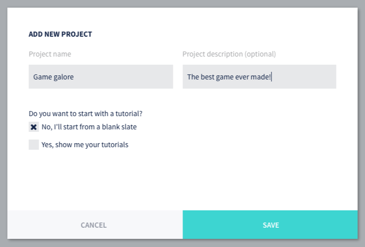

## 新規ゲームプロジェクトの作成

ゲームの作業を開始する前に、ゲームアセットとコード用のストレージを設定する必要があります。最も簡単な方法は、Defold Dashboardでプロジェクトを作成することです。そうすることで、あなたの作品が保存されているクラウドサーバにGitリポジトリが作成されます。

1. [Defold Dashboard](//www.defold.com/dashboard/)にアクセスします。
2. *New Project*をクリックします。
3. プロジェクトの名前を入力して、*Start from a blank slate*を選択します。
4. *Save*をクリックして完了です。

